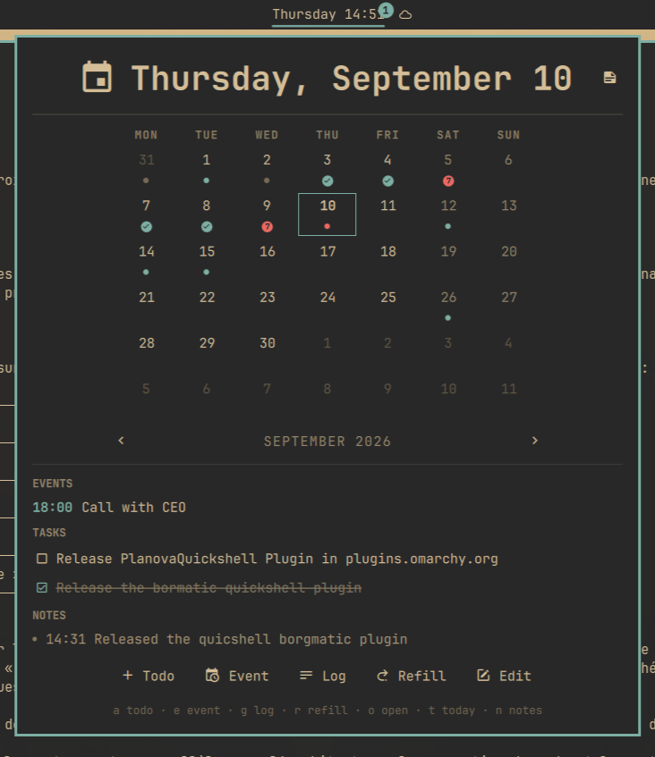
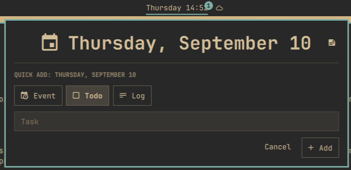
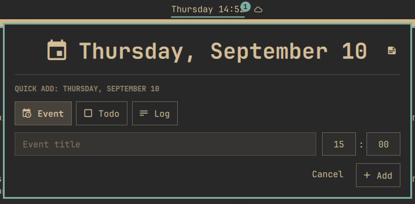

# PlaneTxtQuickShell

An [Omarchy](https://omarchy.org) 4 shell plugin that replaces the date/time
bar widget with a [PlaneTxt](https://github.com/brvier/PlaneTxtFlutter)-backed panel: the
clock label stays (plus a badge counting today's undone todos), and clicking
it opens a calendar with per-day indicators, the selected day's events,
tasks, and notes, quick add, refill, and a notes browser.

Everything reads and writes PlaneTxt's plaintext markdown files directly -
`<Org>/dailies/YYYYMMDD.md` and `<Org>/notes/**/*.md` - using the same
parsing and insertion rules as PlaneTxt itself, with atomic writes. Both apps
watch the files, so edits made in one show up in the other within seconds.

## Screenshots

<p align="center">
  
</p>

<p align="center">
  
  
</p>

## Install

```bash
omarchy plugin add https://github.com/brvier/PlaneTxtQuickShell.git
omarchy plugin enable fr.rvier.planetxt
```

For development, symlink the checkout instead (note: `omarchy plugin add`
refuses symlinks, but the running shell loads them fine):

```bash
ln -s ~/Projects/PlaneTxtQuickShell ~/.config/omarchy/plugins/fr.rvier.planetxt
omarchy-shell shell rescanPlugins
```

The inotify watcher does not follow the symlink, so after editing QML run
`omarchy-restart-shell` to reload (`omarchy-shell shell rescanPlugins` alone
does not reliably refresh already-compiled QML from a symlinked tree).

Then replace the clock in `~/.config/omarchy/shell.json`: in
`bar.layout.center`, change the `omarchy.clock` entry's `id` to
`fr.rvier.planetxt` (its `format`/`formatAlt`/`verticalFormat` settings carry
over unchanged), and set `bar.centerAnchor` to `fr.rvier.planetxt`. The file
hot-reloads on save.

## Uninstall

The plugin never edits `shell.json` itself, so removal is the install in
reverse. Put the clock back first: in `bar.layout.center` change the
`fr.rvier.planetxt` entry's `id` back to `omarchy.clock` (keep the format
settings) and set `bar.centerAnchor` back to `omarchy.clock`. Then:

```bash
omarchy plugin disable fr.rvier.planetxt
omarchy plugin remove fr.rvier.planetxt
```

Your markdown files under the Org root are left untouched.

## Configuration

The plugin finds the Org root and templates from PlaneTxt's own preferences
(`~/.local/share/fr.rvier.planetxt/shared_preferences.json`), falling back to
`~/Org`. Inline settings on the widget's `shell.json` entry override:

| setting | default | meaning |
|---|---|---|
| `format`, `formatAlt` | `dddd HH:mm`, `d MMMM 'W'ww yyyy` | bar label formats (right-click cycles) |
| `verticalFormat`, `verticalFormatAlt` | as the clock | vertical-bar label formats |
| `showTodoBadge` | `true` | undone-todo count badge on the label |
| `storagePath` | PlaneTxt prefs → `~/Org` | Org root |
| `dailyTemplate` | PlaneTxt prefs → built-in | seed for new daily files |
| `todoHeaderRegex`, `eventHeaderRegex`, `logHeaderRegex` | PlaneTxt prefs → built-ins | section header patterns |

## Use

Bar label: left click opens the panel, right click cycles the label format,
middle click opens the timezone picker.

Panel keys - calendar: arrows/`hjkl` move the selected day (`j`/`k` by
week), `[` `]` month, `{` `}` year, `t` today, `Enter`/`Space` focus the task
list (then `j`/`k` + `Space` toggles a todo), `a` add a todo, `e` add an
event, `g` add a log, `r` refill, `o` open the day file in your editor,
`n` notes. Inside the quick-add form, `Ctrl+E`/`Ctrl+T`/`Ctrl+L` switch the
entry type without leaving the title field. Notes: `j`/`k` move, `Enter`
opens in your editor, `/` search, `o` new note, `r` (or right-click) renames,
`x` deletes. `Esc` backs out, then closes.

IPC:

```bash
omarchy-shell fr.rvier.planetxt toggle
omarchy-shell fr.rvier.planetxt today
omarchy-shell fr.rvier.planetxt addTodo "buy milk"
omarchy-shell fr.rvier.planetxt addLog "shipped the release"
```

Other methods: `open`, `close`, `refresh`, `cycleFormat`.

## Development

`PlaneTxtModel.js` holds all parsing/insertion logic (ports of PlaneTxt's
`markdown_parser.dart` and `daily_content_helper.dart`) and is Qt-free:

```bash
node --test tests/model.test.mjs
```

The test file includes 1:1 ports of PlaneTxt's own parser and content-helper
test suites - they are the compatibility contract. If a test needs changing,
PlaneTxt and this plugin have diverged.

## Dependencies

Everything the plugin needs ships with Omarchy 4: the quickshell runtime,
`bash`, `find`, `inotifywait` (inotify-tools, used to watch the Org
directories), and `omarchy-launch-editor` / `omarchy-menu-timezone` for the
editor and timezone actions. No network access, no downloads, no sudo.

[PlaneTxt](https://github.com/brvier/PlaneTxtFlutter) itself is optional. Without it the
plugin still works on `~/Org` (or `storagePath`) with the built-in defaults;
with it, the Org root, templates and header patterns are read from PlaneTxt's
preferences so both apps agree.

Node.js is only needed to run the test suite.

## License

MIT, see [LICENSE](LICENSE).
